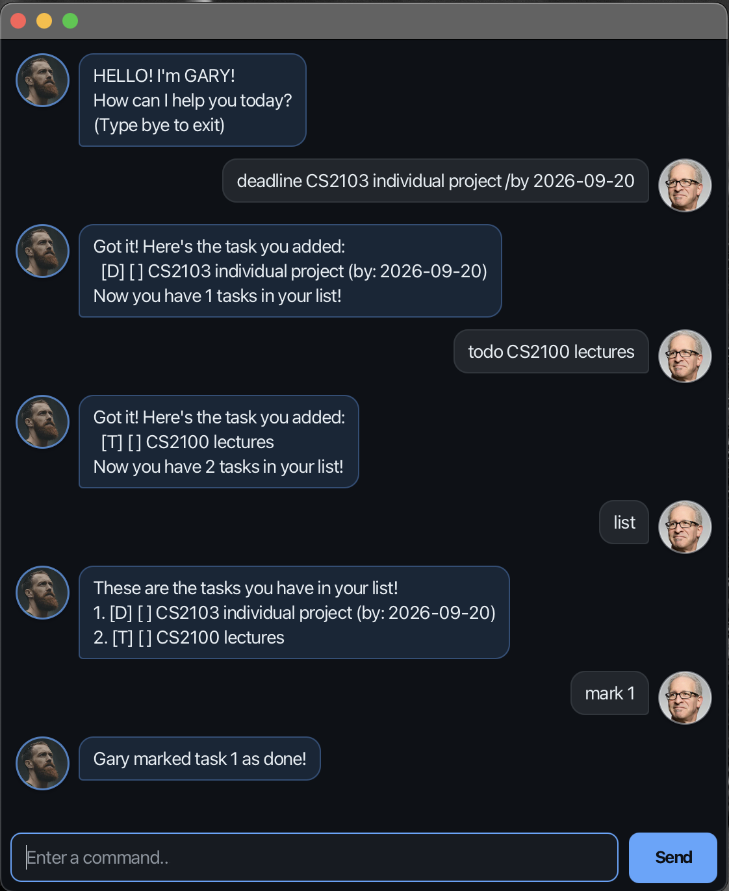

<h1 align="center">Gary User Guide</h1>

<p align="center">
  <strong>A friendly chatbot for keeping everyday tasks under control.</strong><br>
  Add todos, deadlines, and events with simple text commands—Gary saves them
  automatically.
</p>

<p align="center">
  <a href="#quick-start">Quick start</a> ·
  <a href="#command-guide">Command guide</a> ·
  <a href="#quick-reference">Quick reference</a> ·
  <a href="#saving-and-errors">Help</a>
</p>

<p align="center">
  
</p>

## Quick start

> **Note:** Gary requires **JDK 25**.

To launch a downloaded copy of Gary, open a terminal in the folder containing
`duke.jar` and run:

```text
java -jar duke.jar
```

The same JAR contains the JavaFX libraries needed by Windows, macOS, and Linux.

If you are running Gary from its source code instead, use the command for your
platform:

| Platform | Graphical interface | Terminal interface |
| --- | --- | --- |
| macOS / Linux | `./gradlew runGui` | `./gradlew run` |
| Windows | `gradlew.bat runGui` | `gradlew.bat run` |

In the graphical interface, type a command in the box at the bottom, then
press <kbd>Enter</kbd> or select **Send**.

### Before entering a command

- Replace words in `UPPER_CASE` with your own task details.
- Command names are not case-sensitive: `list`, `LIST`, and `List` all work.
- Extra spaces around or between command parts are ignored.
- Use the date format `YYYY-MM-DD`, for example `2026-09-20`.
- Use the positive task number shown by `list` when referring to a task.
- Keep descriptions within 200 characters and do not use the `|` character.

> **Tip:** If you are unsure what to do next, enter `list` to see your tasks
> and their current numbers.

## Command guide

### Add tasks

#### `todo` — add a task without a date

**Format:** `todo DESCRIPTION`<br>
**Example:** `todo revise lecture notes`

#### `deadline` — add a task with a due date

**Format:** `deadline DESCRIPTION /by YYYY-MM-DD`<br>
**Example:** `deadline submit project report /by 2026-09-20`

Use `/by` exactly once. Gary rejects dates that do not exist, such as
`2026-02-30`.

#### `event` — add an activity spanning two dates

**Format:** `event DESCRIPTION /from YYYY-MM-DD /to YYYY-MM-DD`<br>
**Example:** `event orientation camp /from 2026-08-01 /to 2026-08-04`

Use `/from` and `/to` exactly once and in that order. The start date must be
earlier than the end date.

> **Important:** Gary prevents exact duplicate tasks. Differences in
> capitalization or completion status do not make an otherwise identical task
> unique.

### View and manage tasks

#### `list` — view every task

Enter `list` to display every saved task with its number and completion status.

| Symbol | Meaning | Symbol | Meaning |
| :---: | --- | :---: | --- |
| `[T]` | Todo | `[ ]` | Not completed |
| `[D]` | Deadline | `[X]` | Completed |
| `[E]` | Event | | |

For example, `[D] [X] submit report (by: 2026-09-20)` is a completed
deadline.

#### `mark` — mark a task as completed

**Format:** `mark TASK_NUMBER`<br>
**Example:** `mark 2`

#### `unmark` — mark a task as not completed

**Format:** `unmark TASK_NUMBER`<br>
**Example:** `unmark 2`

#### `delete` — remove a task

**Format:** `delete TASK_NUMBER`<br>
**Example:** `delete 3`

Task numbers may change after deletion. If you remove the wrong task, enter
`undo` immediately.

### Find tasks

#### `find` — search task descriptions

**Format:** `find KEYWORD`<br>
**Example:** `find project report`

Gary displays tasks whose descriptions contain the keyword or phrase. The
search is not case-sensitive.

### Undo changes

#### `undo` — reverse the last change

Enter `undo` to reverse the most recent successful `todo`, `deadline`, `event`,
`delete`, `mark`, or `unmark` command.

You can repeat `undo` to reverse up to 100 changes from the current session.
The history is cleared when Gary exits, and an undone change cannot be redone.

### Exit

#### `bye` — save and close Gary

Enter `bye` when you are finished. Gary saves your tasks before closing.

## Quick reference

| What you want to do | Command |
| --- | --- |
| Add a todo | `todo DESCRIPTION` |
| Add a deadline | `deadline DESCRIPTION /by YYYY-MM-DD` |
| Add an event | `event DESCRIPTION /from YYYY-MM-DD /to YYYY-MM-DD` |
| View all tasks | `list` |
| Complete a task | `mark TASK_NUMBER` |
| Reopen a task | `unmark TASK_NUMBER` |
| Remove a task | `delete TASK_NUMBER` |
| Search tasks | `find KEYWORD` |
| Reverse the last change | `undo` |
| Save and exit | `bye` |

## Saving and errors

Gary saves changes automatically in `data/duke.txt`. Avoid editing this file
while Gary is running.

In the graphical interface, errors are highlighted so they are easy to spot.
Gary explains what needs correcting, and invalid commands do not change your
tasks.

> **Warning:** If the task file cannot be read or contains invalid data, Gary
> warns you and starts with an empty list. It will not overwrite the affected
> file during that session. If the file is simply missing, Gary creates it when
> needed.
